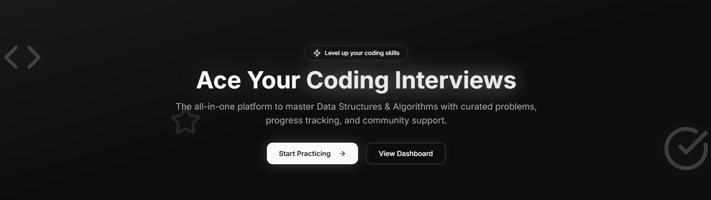

# CrackRank - Coding Interview Preparation Platform

  
*A LeetCode-style platform to ace technical interviews with curated DSA problems, progress tracking, and community support.*

## 🚀 Features

### 📚 Problem Library
- 50+ curated DSA problems tagged by:
  - **Difficulty**: Easy/Medium/Hard
  - **Companies**: Google, Amazon, Meta, etc.
  - **Topics**: Arrays, Graphs, DP, etc.
- Advanced search & filtering

### 💻 Code Editor
- Syntax highlighting (Python/JS/Java)
- Simulated code execution
- Submission history tracking

### 📊 Progress Analytics
- Personalized dashboard showing:
  - Solved problems count
  - Streak tracking (🔥)
  - Accuracy metrics
  - Submission history graph

### 🛠 Admin Tools
- Problem management system
- Content moderation

## 🛠 Tech Stack

**Frontend**:
- React + TypeScript
- Vite (Build Tool)
- Tailwind CSS + shadcn-ui
- Monaco Editor (Code Editor)

**Backend**:
- Node.js (API Routes)
- PostgreSQL (Database)

**Deployment**:
- Vercel (Frontend)
- Supabase (Backend/Database)

## 🏗 Development Setup

1. **Clone the repository**
   ```bash
   git clone https://github.com/himkarsingh/crackrank.git
   cd crackrank
2. **Install dependencies**
   ```bash
   npm install
3. **CConfigure environment variables**
   Create .env file: 
   ```bash
   VITE_API_URL=your_api_url
   VITE_SUPABASE_URL=your_supabase_url
   VITE_SUPABASE_KEY=your_supabase_key
4. **Run development server**
   ```bash
   npm run dev


